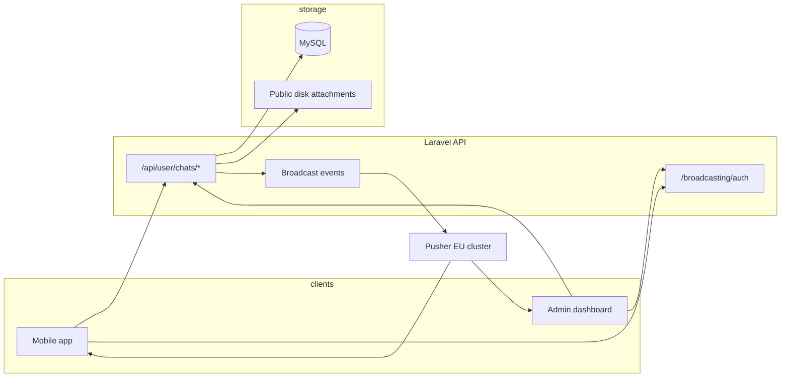

# Support live chat — documentation

Student-Path includes **support live chat**: app users (guardians, drivers, students) message the **support team** (admin users). Messages are stored in MySQL and delivered in real time via **Pusher** (Laravel broadcasting).

This is **not** peer-to-peer marketplace chat. Each app user has at most one **open** support conversation; admins see all conversations and reply from the API or the web dashboard.

---

## Table of contents

1. [Architecture](#architecture)
2. [Roles and access](#roles-and-access)
3. [Database](#database)
4. [Configuration](#configuration)
5. [REST API](#rest-api)
6. [Realtime (Pusher / Echo)](#realtime-pusher--echo)
7. [Web dashboard](#web-dashboard)
8. [Postman](#postman)
9. [Mobile integration flow](#mobile-integration-flow)
10. [Errors and edge cases](#errors-and-edge-cases)
11. [Related files](#related-files)

---

## Architecture



| Layer | Responsibility |
|--------|----------------|
| **REST** | List/start chats, send messages, read/unread, pin/mute, block, offers (optional) |
| **Broadcasting** | `ChatMessageSent`, `ChatMessageUpdated`, `ChatTypingStatusUpdated`, `ChatOfferUpdated` |
| **Channel auth** | `routes/channels.php` — only conversation owner or admin may join `private-chat.{id}` |
| **Dashboard** | Blade UI at `/dashboard/support-chat` for staff (session + CSRF for Echo auth) |

---

## Roles and access

| Actor | Can start chat? | Sees conversations | Can send messages? | Notes |
|--------|-----------------|--------------------|--------------------|--------|
| **App user** (guardian / driver / student) | Yes (`POST .../start`) | Own conversations only | Yes, unless blocked | One open conversation per user (`status = open`) |
| **Admin** (`is_admin`) | No (403 on start) | All conversations | Yes | `other_user` in list = the app user |
| **Blocked pair** | — | Hidden from list for blocker | **403** on send | Bidirectional block via `user_blocks` |

**Access rule** (`ChatConversation::canBeAccessedBy`):

- Admin → any conversation  
- Non-admin → only where `chat_conversations.user_id` = their user id  

There are **no Spatie permissions** on chat routes; only Sanctum auth + the rules above.

**Who can start chat:** Any authenticated non-admin Sanctum user. There is no `type_user` check on chat endpoints (guardian, driver, and student are all allowed unless you add a restriction later).

---

## Database

### `chat_conversations`

| Column | Description |
|--------|-------------|
| `user_id` | App user who owns the support thread |
| `participant_id` | Optional assigned admin user |
| `post_id` | Optional context id (legacy field from MyAppBackend contract) |
| `status` | `open` or `closed` |
| `subject` | Optional (legacy `/api/chat` API) |
| `last_message_at` | Updated when a message is sent |
| `user_last_read_at` | App user read cursor |
| `staff_last_read_at` | Admin read cursor |

### `chat_messages`

| Column | Description |
|--------|-------------|
| `chat_conversation_id` | Parent conversation |
| `user_id` | Sender |
| `message_type` | `text`, `offer`, `image`, `file` |
| `body` | Text (nullable for file-only) |
| `meta` | JSON: offer fields, attachment URL, edit/delete flags |
| `read_at` | Per-message read receipt (incoming messages marked read on `POST .../read`) |

### `chat_conversation_user_settings`

Per-user preferences: `is_pinned`, `pinned_at`, `is_muted`.

### `user_blocks`

`blocker_id`, `blocked_id`, optional `reason`. Blocks hide conversations from the blocker’s list and prevent sending (403).

**Migrations:**

- `database/migrations/2026_05_23_120000_create_chat_tables.php`
- `database/migrations/2026_05_23_140000_extend_chat_tables_for_user_api.php`
- `database/migrations/2026_05_23_160000_create_chat_user_settings_and_blocks_tables.php`

Run:

```bash
php artisan migrate
```

---

## Configuration

### Environment (`.env`)

```env
# Broadcasting — use "pusher" in production when credentials are set
BROADCAST_CONNECTION=pusher

PUSHER_APP_ID=
PUSHER_APP_KEY=
PUSHER_APP_SECRET=
PUSHER_APP_CLUSTER=eu
PUSHER_SCHEME=https

# Optional chat tuning (see config/chat.php)
CHAT_DEFAULT_CURRENCY=IQD
CHAT_SUPPORT_DISPLAY_NAME=Support
CHAT_ATTACHMENT_DISK=public
```

For local development without Pusher, set `BROADCAST_CONNECTION=log` or `null` (see `.env.example`). REST APIs still work; realtime events are only logged.

### `config/chat.php`

| Key | Default | Purpose |
|-----|---------|---------|
| `private_channel_template` | `chat.{conversationId}` | Echo channel name (without `private-` prefix) |
| `event_name` | `message.sent` | New message event |
| `typing_event_name` | `typing.updated` | Typing indicator |
| `message_updated_event_name` | `message.updated` | Edit/delete |
| `offer_updated_event_name` | `offer.updated` | Offer accept/reject/counter |
| `max_message_length` | `5000` | Text body limit |
| `default_currency` | `IQD` | Offer messages |
| `attachment_max_kb` | `20480` | Upload limit |
| `attachment_mimes` | jpg, png, pdf, … | Allowed file types |

Pusher connection details: `config/broadcasting.php` and `config/realtime.php`.

---

## REST API

All chat routes require **`Authorization: Bearer {sanctum_token}`** and `Accept: application/json`.

### Primary API — `/api/user/chats`

Used by mobile apps and documented in Postman. Response shape:

```json
{
  "message": "Human-readable status",
  "data": { },
  "pagination": { }
}
```

`data` uses `ConversationResource` / `MessageResource`.

#### Conversations

| Method | Path | Description |
|--------|------|-------------|
| `GET` | `/api/user/chats?search=&per_page=20` | List (pinned first). Admin: search by user name/phone. |
| `GET` | `/api/user/chats/unread-count` | Total unread messages (excludes **muted** chats) |
| `POST` | `/api/user/chats/start` | Create or return existing **open** conversation |
| `GET` | `/api/user/chats/{id}/messages?per_page=30` | Paginated messages (newest first) |
| `POST` | `/api/user/chats/{id}/read` | Mark incoming messages read → `data.updated_count` |
| `POST` | `/api/user/chats/{id}/unread` | Mark as unread → `data.updated_count` |

**Start conversation body:**

```json
{
  "participant_id": 1,
  "post_id": null
}
```

- `participant_id` — optional; must be an **admin** user id  
- If omitted, support is shown as `config('chat.support_display_name')` until an admin replies  
- Returns `existing: true` if an open conversation already exists (HTTP 200); otherwise 201  

#### Messages

| Method | Path | Description |
|--------|------|-------------|
| `POST` | `/api/user/chats/{id}/messages` | Send text, offer, or file |
| `PUT` | `/api/user/chats/{chatId}/messages/{messageId}` | Edit own text (`body`) |
| `DELETE` | `/api/user/chats/{chatId}/messages/{messageId}` | Soft-delete own message |

**Send text:**

```json
{
  "message_type": "text",
  "body": "مرحبا، أحتاج مساعدة"
}
```

**Send offer** (optional feature, MyAppBackend parity):

```json
{
  "message_type": "offer",
  "body": "عرض",
  "meta": {
    "amount": 125000,
    "currency": "IQD",
    "title": "عرض",
    "details": "تفاصيل",
    "valid_until": "2026-12-31T12:00:00Z"
  }
}
```

**Send file** — `multipart/form-data`: `message_type=file`, `body`, `attachment`.

| Method | Path | Description |
|--------|------|-------------|
| `POST` | `.../messages/{messageId}/offer/accept` | Accept offer |
| `POST` | `.../messages/{messageId}/offer/reject` | Body: `{ "reason": "..." }` |
| `POST` | `.../messages/{messageId}/offer/counter` | Counter-offer fields in JSON body |
| `GET` | `/api/user/chats/{chatId}/offers/{messageId}/thread` | Offer revision history |

#### Preferences, pin, block

| Method | Path | Description |
|--------|------|-------------|
| `PUT` | `/api/user/chats/{id}/preferences` | `{ "is_pinned": true, "is_muted": false }` (at least one field) |
| `POST` | `/api/user/chats/{id}/pin` | Pin for current user |
| `POST` | `/api/user/chats/{id}/unpin` | Unpin |
| `POST` | `/api/user/chats/{id}/block-user` | Optional `{ "reason": "spam" }` |
| `POST` | `/api/user/chats/{id}/unblock-user` | Remove block with other party |

#### Realtime helper

| Method | Path | Body |
|--------|------|------|
| `POST` | `/api/user/chats/{id}/typing` | `{ "is_typing": true }` |
| `DELETE` | `/api/user/chats/{id}` | Soft-delete conversation (owner or admin) |
| `POST` | `/api/user/chats/{id}/report` | Body: `reason` (required), `details` (optional) |

### In-app notifications (chat)

When a message is sent, the backend creates an **`in_app_notifications`** row for the recipient(s):

- **User receives** when admin/support replies.
- **Admin(s) receive** when app user sends (assigned `participant_id`, or all admins if unset).
- **Skipped** if recipient muted the chat (`is_muted` on preferences).
- **Disabled** if `CHAT_IN_APP_NOTIFICATIONS_ENABLED=false` in `.env`.

Notification `data` payload:

```json
{
  "type": "CHAT_MESSAGE",
  "conversation_id": 1,
  "chat_id": 1,
  "message_id": 10,
  "sender_id": 2,
  "sender_name": "Support"
}
```

List via `GET /api/in-app-notifications` (existing API). Realtime still uses Pusher.

### Legacy API — `/api/chat`

Same business logic, **parent transport** response format (`success`, `message`, `data`):

| Method | Path |
|--------|------|
| `GET` | `/api/chat/config` |
| `GET` | `/api/chat/unread-count` |
| `GET` | `/api/chat/conversations` |
| `POST` | `/api/chat/conversations` |
| `GET` | `/api/chat/conversations/{id}` |
| `GET` | `/api/chat/conversations/{id}/messages` |
| `POST` | `/api/chat/conversations/{id}/messages` |
| `POST` | `/api/chat/conversations/{id}/read` |
| `POST` | `/api/chat/conversations/{id}/unread` |
| `PUT` | `/api/chat/conversations/{id}/preferences` |
| `POST` | `/api/chat/conversations/{id}/pin` |
| `POST` | `/api/chat/conversations/{id}/unpin` |
| `POST` | `/api/chat/conversations/{id}/block-user` |
| `POST` | `/api/chat/conversations/{id}/unblock-user` |
| `DELETE` | `/api/chat/conversations/{id}` |
| `POST` | `/api/chat/conversations/{id}/report` |

**Config response** (`GET /api/chat/config`):

```json
{
  "success": true,
  "message": "success",
  "data": {
    "enabled": true,
    "private_channel_template": "chat.{conversationId}",
    "event_name": "message.sent",
    "laravel_echo": {
      "broadcaster": "pusher",
      "key": "...",
      "cluster": "eu",
      "auth_endpoint": "https://your-host/broadcasting/auth",
      "force_tls": true
    }
  }
}
```

---

## Response models

### Conversation (`ConversationResource`)

```json
{
  "id": 1,
  "post_id": null,
  "unread_count": 2,
  "is_pinned": false,
  "is_muted": false,
  "pinned_at": null,
  "is_blocked": false,
  "other_user": {
    "id": 5,
    "name": "Support",
    "type": "staff",
    "image": null
  },
  "last_message": { },
  "last_message_at": "2026-05-23T10:00:00+00:00",
  "status": "open",
  "created_at": "2026-05-23T09:00:00+00:00"
}
```

- App user sees **support** as `other_user` (admin or display name).  
- Admin sees the **app user** as `other_user`.

### Message (`MessageResource`)

```json
{
  "id": 10,
  "conversation_id": 1,
  "sender": {
    "id": 3,
    "name": "Ahmed",
    "type": "user",
    "is_staff": false,
    "image": null
  },
  "body": "Hello",
  "message_type": "text",
  "meta": {},
  "attachment": null,
  "is_deleted": false,
  "is_edited": false,
  "edited_at": null,
  "offer": null,
  "read_at": null,
  "created_at": "2026-05-23T10:01:00+00:00"
}
```

---

## Realtime (Pusher / Echo)

### Channel authorization

- **Endpoint:** `POST /broadcasting/auth`  
- **Middleware:** `auth:sanctum` (mobile) or web session (dashboard)  
- **Channel:** `private-chat.{conversationId}` (Echo: `echo.private('chat.' + id)`)  

Registered in `routes/channels.php` — returns user payload or `false`.

### Events (listen on private channel)

| Event name (Echo) | When | Payload highlight |
|-------------------|------|-------------------|
| `.message.sent` | New message | `{ conversation_id, message: MessageResource }` |
| `.message.updated` | Edit / delete | Updated `message` object |
| `.typing.updated` | Typing API called | `{ user, is_typing }` |
| `.offer.updated` | Offer action | Offer status change |

### Mobile example (Laravel Echo)

```javascript
import Echo from 'laravel-echo';
import Pusher from 'pusher-js';

const echo = new Echo({
  broadcaster: 'pusher',
  key: PUSHER_KEY,           // from GET /api/chat/config
  cluster: 'eu',
  forceTLS: true,
  authEndpoint: `${API_BASE}/broadcasting/auth`,
  auth: {
    headers: { Authorization: `Bearer ${token}` },
  },
});

const conversationId = 1;

echo
  .private(`chat.${conversationId}`)
  .listen('.message.sent', (e) => {
    // e.message — same shape as REST MessageResource
    appendMessage(e.message);
  })
  .listen('.typing.updated', (e) => {
    setTyping(e.user.id, e.is_typing);
  });
```

**Trip tracking** uses a separate channel: `private-trip.{tripHistoryId}` — not chat.

---

## Web dashboard

For users with `is_admin`:

| URL | Purpose |
|-----|---------|
| `/dashboard/support-chat` | List all support conversations |
| `/dashboard/support-chat/{id}` | Open thread, reply, realtime updates |
| `POST .../close` | Set `status = closed` |
| `POST .../reopen` | Set `status = open` |

Sidebar: **Live support chat** (admin only).

Echo on the dashboard uses **session cookies** + CSRF for `/broadcasting/auth`.

---

## Postman

Import:

`postman/User-Chat.postman_collection.json`

**Student-Path Support Chat APIs** includes:

- Auth (OTP) to obtain `user_token` / `admin_token`
- All `/api/user/chats/*` endpoints
- All `/api/chat/*` legacy endpoints
- `POST /broadcasting/auth` sample

**Quick test:**

1. Set collection variable `base_url`.  
2. Verify OTP → copy token to `user_token`.  
3. **Start Support Conversation** → set `chat_id` from `data.id`.  
4. **Send Text Message** / **Mark Conversation Read**.  
5. For admin: use `admin_token` → **Admin — List all** / **Admin — Reply text**.

---

## Mobile integration flow

Recommended sequence for a support chat screen:

1. **Login** — `POST /api/auth/verify-otp` → store Sanctum token.  
2. **Config** — `GET /api/chat/config` → Pusher key, cluster, `enabled`.  
3. **Start or resume** — `POST /api/user/chats/start` → `conversation id`.  
4. **Subscribe** — Echo `private('chat.' + id)` with Bearer auth.  
5. **History** — `GET /api/user/chats/{id}/messages`.  
6. **Send** — `POST /api/user/chats/{id}/messages`.  
7. **Read** — `POST /api/user/chats/{id}/read` when screen is visible.  
8. **Badge** — `GET /api/user/chats/unread-count` on app resume.  
9. **Typing** — debounced `POST .../typing` with `{ "is_typing": true/false }`.

---

## Errors and edge cases

| HTTP | Situation |
|------|-----------|
| `401` | Missing or invalid token |
| `403` | Admin tries `POST .../start`; user blocked; edit/delete someone else’s message |
| `404` | Conversation not found or not accessible |
| `422` | Validation (empty body, invalid offer, file too large) |

**Unread count:** Messages in **muted** conversations are excluded from `GET .../unread-count`.

**One open chat:** Starting chat again returns the same open row (`existing: true`).

**Closed chat:** Legacy API and dashboard can close/reopen; mobile should handle `status: "closed"` (sending may still be allowed depending on product rules — verify in `ChatMessenger` if you restrict closed threads).

---

## Related files

| Area | Path |
|------|------|
| User API controller | `app/Http/Controllers/Api/User/ChatController.php` |
| Legacy API controller | `app/Http/Controllers/Api/V1/ChatController.php` |
| Dashboard | `app/Http/Controllers/Web/DashboardChatController.php` |
| Services | `app/Services/Chat/*` |
| Models | `app/Models/ChatConversation.php`, `ChatMessage.php` |
| Resources | `app/Http/Resources/Chat/*` |
| Events | `app/Events/ChatMessageSent.php`, etc. |
| Routes | `routes/api.php`, `routes/web.php`, `routes/channels.php` |
| Tests | `tests/Feature/UserChatApiTest.php`, `ChatApiTest.php`, `DashboardSupportChatTest.php` |
| Setup quick reference | `docs/PUSHER_CHAT_SETUP.md` |

---

## Tests

```bash
php artisan test --filter=Chat
```

Covers user API, legacy `/api/chat`, and dashboard support chat.
